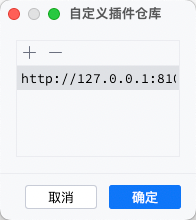

# idea插件仓库

## 计划

版本 1：本地仓库-手动版：手动上传插件到服务器的指定目录，并刷新

版本 2：本地仓库-后台版：后台页面上传插件

版本 3：本地仓库-数据库版：插件数据库持久化

版本 4：云存储版：使用云存储存放插件

版本 5：展示版：支持插件的信息展示，搜索，版本展示

版本 6：多租户版：支持多租户用户体系

## 项目使用说明

### 源码编译

`mvn clean package -DskipTests`

会得到一个压缩包`idea-plugins-repositories-0.0.1-SNAPSHOT.zip`,上传到服务器。

你也可以[直接从这下载](https://gitee.com/zsdroid/jetbrains_ides_plugins_repositories/releases/)编译好的软件包

### 部署

第一步：当前完成了版本1，部署时需要修改配置文件：`config/application.properties`

配置文件：
```properties
# 端口配置，默认8080
server.port=8101
# 本地插件仓库，可以通过nginx透出
cn.zhusaidong.idea.plugins.repositories.local.host=http://127.0.0.1:${server.port}/files/plugins/
# 本地插件仓库目录，最好使用绝对目录
cn.zhusaidong.idea.plugins.repositories.local.plugin-dir=plugins/
```

第二步：然后运行启动脚本：`bash bin/start.sh`

第三步：上传插件压缩包到plugins插件目录， 浏览器运行`http://127.0.0.1:8101/admin/plugin/refresh` ，即可刷新数据

第四步：将`http://127.0.0.1:8101/` ,输入ide的自定义仓库即可


